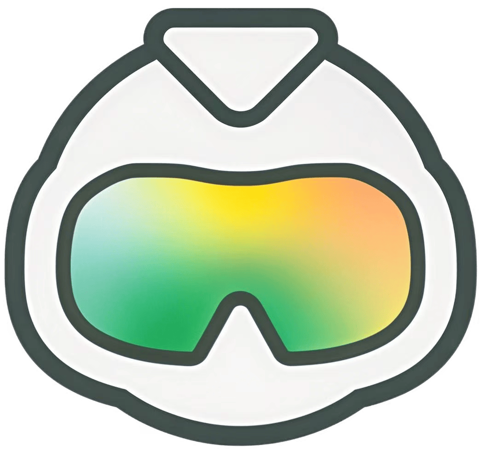

<p align="center">
  
</p>

<h1 align="center">Midscene Browser</h1>
<div align="center">

[English](./README.en.md) | 简体中文

</div>

<p align="center">
  让 AI 成为你的浏览器操作员, 基于 Midscene.js 的 Chrome 浏览器扩展
</p>

## 案例


|    网站    |                    指令                     |                            视频                            |
|:--------:|:-----------------------------------------:|:--------------------------------------------------------:|
| deepseek | 询问 deepseek 最新的国际新闻，提取与中国有关的内容，并判断是否与关税相关 | <video src="public/videos/deepseek.webm" height="300" /> |
|  淘宝      |             我想要买一个300元左右的降噪耳机             |              <video src="" height="300" />               |


## 功能特点

- **自然语言互动 👆**：只需描述你的目标，Midscene Browser 会为你规划操作步骤和操作用户界面。
- **Midscene.js 增强 🔥**: 将 Midscene 的 action, query, assert 操作通过组合 agent 完美结合
- **高级知识库增强 🔧**：通过高级知识库配置，增强 AI 对网站的理解
- **AI 模型集成 🤖**：支持多种 AI 模型，包括 GPT-4o 和开源替代品

## AI 模型配置
[与 Midscene.js 配置参数一致](https://midscenejs.com/zh/choose-a-model)。

## 安装方法

### 开发者安装（从源码）

1. 克隆仓库
2. 安装依赖：`npm install`
3. 构建扩展：`npm run build`
4. 打开 Chrome 浏览器，导航至 `chrome://extensions/`
5. 在右上角启用"开发者模式"
6. 点击"加载已解压的扩展程序"并选择 `dist` 目录

## 使用方法

1. 点击 Chrome 工具栏中的 Midscene Browser 图标
2. 打开网站，在输入框中输入你的任务，比如淘宝网 “我想要买一个300元左右的降噪耳机”

## 开发指南

### 前提条件

- Node.js 16+
- npm

### 环境设置

```bash
# 安装依赖
npm install

# 构建扩展
npm run build

# 启动开发服务器
npm run dev
```

## 贡献指南

欢迎贡献，提交 issue！

## 许可证

本项目采用 MIT 许可证。

## 致谢

本项目基于 [Midscene.js](https://github.com/web-infra-dev/midscene) 开发。特别感谢 Midscene 团队创造了这个令人惊叹的工具，让 AI 驱动的浏览器自动化变得触手可及。

---

<div align="center">
  如果本项目对你有帮助或启发，请给我们一个 ⭐️
</div>